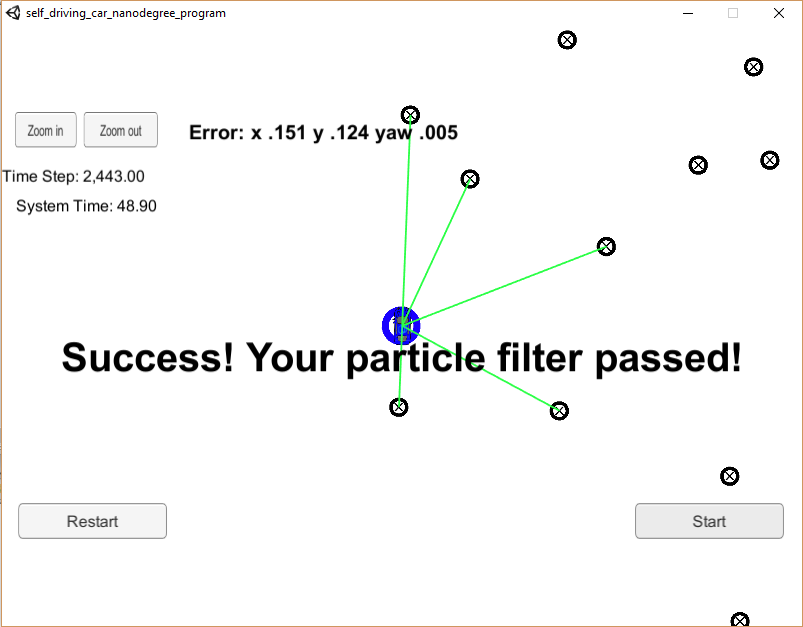

# Kidnapped Vehicle Project

## Overview
This repository contains the work I did within **Project #8 of Udacity's Self-Driving Car Nanodegree Program** (third project of second term). Objective of this project is to **design a 2-D particle filter to localize a "kidnapped" vehicle**. Implementation is done in **C++**. 

Vehicle state is defined by three coordinates: x, y and theta (yaw).
The particle filter is given a map with landmarks and some initial localization information (analogous to what a GPS would provide, accuracy ~0.3m). At each time step the filter gets noisy observations (which are the positions of  some of  the landmarks, as measured by a radar or a lidar) and noisy control data (velocity and yaw rate). This data is provided by a car driving simulator that Udacity has developed (it can be downloaded [here](https://github.com/udacity/self-driving-car-sim/releases)).
The filter predicts the new position of the car using the control data, then updates the particle weights using the noisy observations, and finally resamples the particles.

## Repository content

The repository includes the following files:

 - source code in the */src* folder
	 - main.cpp : communicates with the Simulator, receiving observations and controls, runs the particle filter and calls the associated methods. 
	 - particle_filter.h & .cpp:  initializes the filter, defines the state prediction, weight update and resampling functions
 	 - helper_functions.h : useful functions
 	 - map.h: defines the Map class
 	 - json.hpp: JSON is used for communication with simulator
 - /data: contains _map_data.txt_ which includes the position of landmarks (in meters) on an arbitrary Cartesian coordinate system. Each row has three columns:    |   x position  |     y position |    landmark id

 - CMakeLists.txt: file that is used for compiling code

[Here](https://discussions.udacity.com/t/getting-started-with-docker-and-windows-for-the-ekf-project-a-guide/320236]) is a link which details how to have the simulator and code run with Docker on Windows.

## Communication protocol with simulator

Here is the main protocol that main.cpp uses for uWebSocketIO in communicating with the simulator.

* INPUTS: values provided by the simulator to the c++ program
	 * sense noisy position data from the simulator (used for initialization)
		["sense_x"]
		["sense_y"]
		["sense_theta"]
	 * get the previous velocity and yaw rate to predict the particle's transitioned state
	["previous_velocity"]
	["previous_yawrate"]
	 * receive noisy observation data from the simulator, in a respective list of x/y values to update weights
	["sense_observations_x"]
	["sense_observations_y"]

* OUTPUTS: values provided by the c++ program to the simulator
	* best particle values used for calculating the error evaluation
	["best_particle_x"]
	["best_particle_y"]
	["best_particle_theta"]

## Success Criteria
The simulator includes a grading code. The things the grading code is looking for are:

1. **Accuracy**: the particle filter should localize vehicle position and yaw to within the values specified in the parameters `max_translation_error` and `max_yaw_error`.
	
2. **Performance**: the particle filter should complete execution within the time of 100 seconds.

## Results
Running the simulator we can see the path that the car drives along with all of its landmark measurments. The figures below represent the simulator at the end of the simulation. The car represents the true position of the tracked object. Landmarks are represented by black circled crosses and lidar measurements by green segments. The position estimated by the particle filter is the blue circle. 

Final position error (x,y,yaw) is mentioned as well as time step and system time.

We can see the message _"Success! Your particle filter passed!"_ which means we met the accuracy and time criteria . This figure is the result of the simulation of a filter with 10 particles. I also tested the filter for 100 and 1000 particles. 
The final accuracy and time values are given in the table below: 
|Particle #| x (m)| y (m) | yaw (rad) | time (s) |
|:--------:|:----:|:----:|:----: |
|10|0.141|0.124|0.005|48.90|
|100|0.113|0.104|0.004| 49.62
|1000|0.109|0.100|0.003| 145.62

Obviously the accuracy increases with the number of particles, but at the expense of simulation time. For 1000 particles, the time criteria fails.

